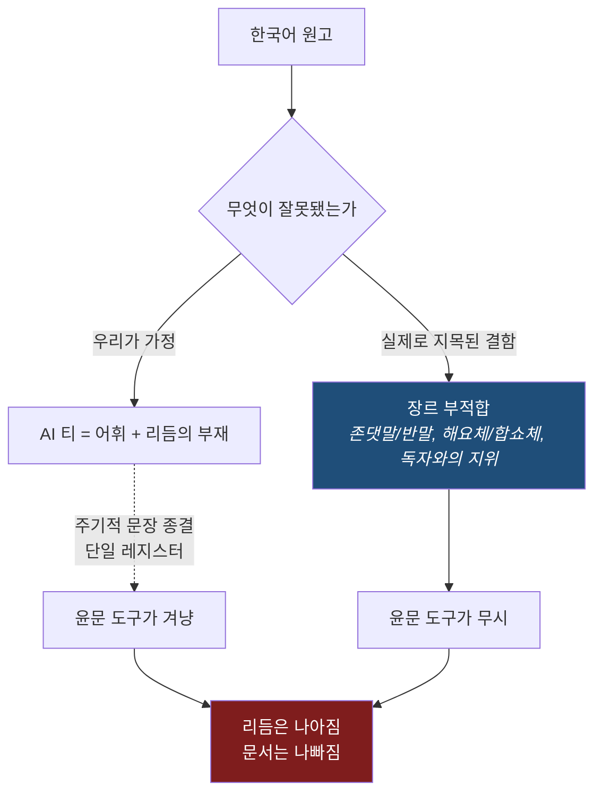

# looks-like-korean

**Deterministic Korean prose measurement. No LLM call, no dependencies.**

> **Retraction, first.** We shipped v0.1.0 claiming that lowering sentence-ending
> *uniformity* makes Korean read more human. Our own demo then disproved it: in **7 of 7**
> pairs, the uniformity-lowered rewrite read **worse**. The metric moved; the writing did
> not. Details and the failure data are below and in
> [`eval/counterexamples.json`](eval/counterexamples.json). v0.2.0 removes the claim.

```bash
pip install looks-like-korean
looks-like-korean score draft.md
looks-like-korean compare before.md after.md
```

## What we actually got wrong

Our starting question was "how do we remove AI tells". That was the wrong question, and
shipping a metric made the mistake obvious.

The AI-flavoured text we used as the **before** in our demo was not bad writing. It was
readable, clear, professionally pitched Korean:

> 회의 시간이 변경되어 안내드립니다. 이번 주 목요일 회의는 오후 3시에서 오전 11시로
> 앞당겨집니다. 장소는 3층 소회의실로 변경되었습니다.

It is *generic*. And generic is not a defect. We rewrote it to make the endings vary, and
produced this:

> 회의 시간이 갑자기 앞당겨져서 먼저 공지해 **둡니다**. … 시간이 안 되는 분은 **있나요?**
> 네, 그럼 이대로 **갑니다**.

The invented dialogue is a tell of its own — nobody writes that in a work memo. We wrote it
because a number told us to.

| pair | genre | what broke in the rewrite |
|---|---|---|
| ex-01 | memo | 「있나요? 네, 그럼 갑니다」 — a conversation that never happened |
| ex-02 | self-introduction | ends in **반말**: 「배울 게 많음」 |
| ex-03 | proposal | 「좀 봐 주시겠어요?」 in a document addressed to an agency |
| ex-04 | report | 「이게 계절 탓인지」 반말, plus 「12% 더 나갔고.」 fragment |
| ex-07 | memo | 「지금 물어보고 가」 to colleagues |
| ex-08 | proposal | 「많습니다」 → 「많음」 inside one document |
| ex-09 | report | 「생각보다 훨씬 낮더라고요」 in an official results report |

In every case `uniformity_index` fell from 1.000 to between 0.015 and 0.130. In every case
a Korean reader preferred the original.

## The finding underneath the failure



Existing Korean humanizers ([`im-not-ai`](https://github.com/epoko77-ai/im-not-ai), MIT,
5.7k stars — genuinely good work) optimise the left branch: they find 85 sub-patterns of
translationese, mechanical parallelism and register-heavy phrasing, and edit surgically.
That is the right tool for real tells.

They systematically miss the right branch. **Nobody measures whether the register suits
the genre and the reader.** So a humanizer will happily turn a deferential official notice
into 해요체, because 해요체 is *more varied* and therefore scores better on every rhythm
metric — including ours.

> **The failure mode of Korean humanizers is not leaving defects in. It is introducing
> genre violations while removing nothing.** Our own tool did it in seven consecutive
> attempts. That is the hole.

A second, independent measurement agrees. A genre-matched corpus attempt
([`docs/RESEARCH.md`](docs/RESEARCH.md)) returned `uniformity_index` at **AUC 0.056** — the
opposite of the hypothesis, by a wide margin, with the cause identified as prose-versus-
template-layout differences rather than human-versus-machine.

## What the engine is, honestly

A **rhythm variety meter**. Nine deterministic metrics, standard library only, no model
call. It is useful for one thing: telling you when a document has used a single
sentence-ending register from start to finish, so you can decide deliberately.

It is **not** a quality metric, **not** an AI detector, and the per-metric direction table
in `src/looks_like_korean/metrics.py` remains an unconfirmed hypothesis. Read
[`docs/RESEARCH.md`](docs/RESEARCH.md) before quoting any direction.

| metric | what it measures |
|---|---|
| `uniformity_index` | `1 − normalised entropy` of the ending-register distribution. 1.000 = the whole document uses one register |
| `max_same_register_run` | longest run of identical register, in sentences |
| `register_switch_rate` | register changes inside a 3-sentence window |
| `sentence_len_gini` / `sentence_len_logstd` | spread of sentence lengths |
| `nominal_ratio` / `nominal_position` | nominal endings (`~함`, `~지`, `~기`) and where they land |
| `hangul_ratio` | non-Hangul character share (reported; **no direction assumed**) |
| `repeat_ngram_rate` | repeated ending n-grams |

`analyze(t).uniformity_index` and `analyze(t).value('uniformity_index')` both work.

## Measuring refused to answer

`research/measure.py` blocks on sample size and genre overlap rather than emitting a number
it cannot stand behind:

```
$ python research/measure.py --corpus <dir>

## 측정 불가
- ⛔ 장르 교집합 0 — 비교 대상이 같은 문종이 아니다
**AUC 을 내지 않는다.**
```

The corpus behind the numbers in this README is private and is not published. Published
examples are self-authored.

## What we need next

Not more metrics. **Paired human preference data**: for a Korean rewrite, which of two
versions does a reader actually prefer? We have no such set, which is precisely why
`uniformity_index` looked like a quality signal for a day. If you write or edit Korean
professionally, paired judgements on `eval/` pairs are worth more to this project than
another metric.

## Not in scope

* Not a scrubber — see [`im-not-ai`](https://github.com/epoko77-ai/im-not-ai). Do not rebuild it.
* Not a prompt. If a judgement needs a model reading the text, it belongs in a model.
* Not Korean-plus-languages. A name that over-promises is worse than a narrow promise.

## Install / test / contribute

```bash
pip install -e .
python -m unittest discover -s tests
```

Branching and PR conventions are in [`docs/BRANCHING.md`](docs/BRANCHING.md) — including the
rule that a `research/` branch may not change the direction table without an evidence trail
in `docs/RESEARCH.md`. Issues use the templates under `.github/ISSUE_TEMPLATE/`.

MIT. See [LICENSE](LICENSE).
